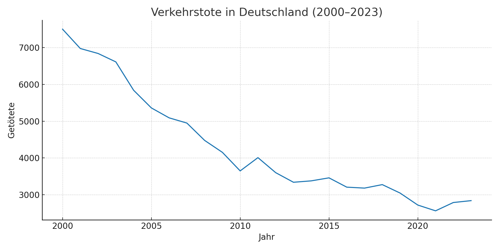
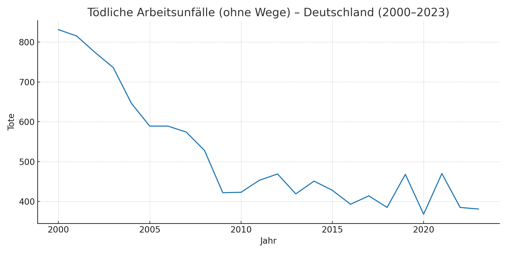
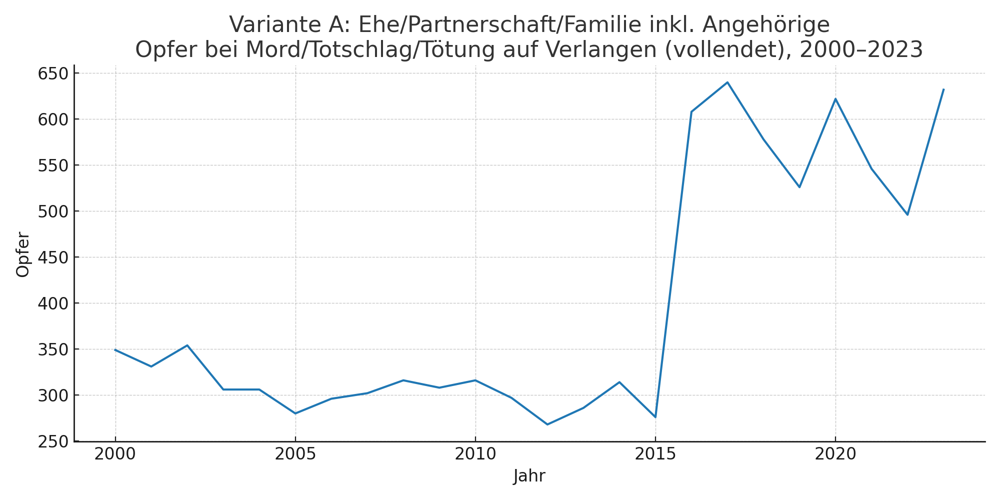
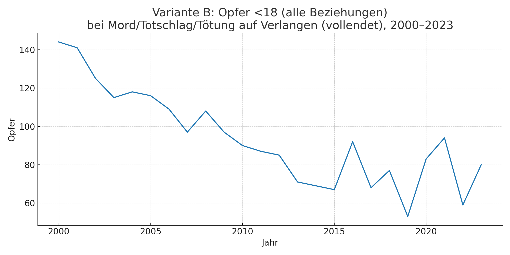
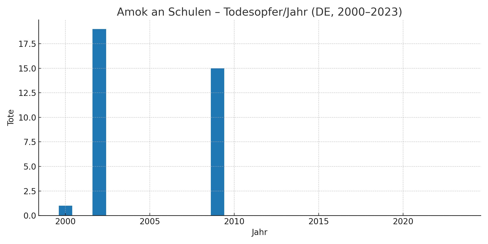
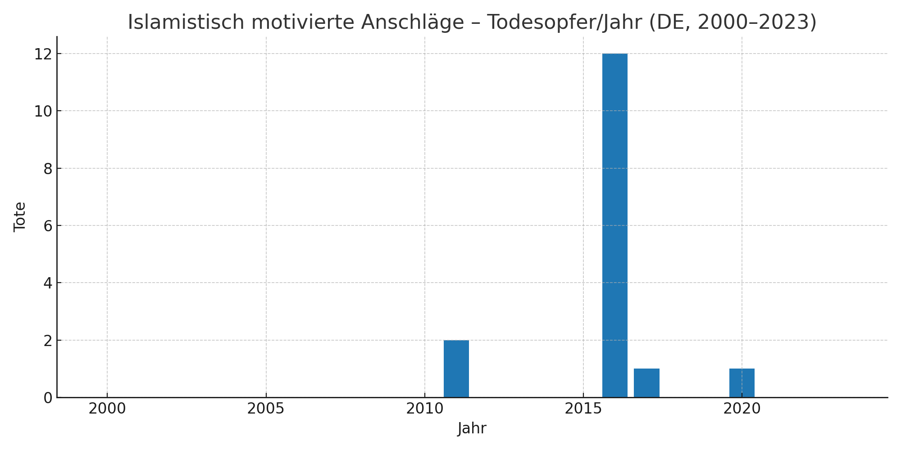

# Todesursachen, politische Gewalt & Kriminalität (Deutschland, 2000–2023)

---

## 1. Todesfälle von Menschen mit psychiatrischen Diagnosen — **935.608**
  
CSV: [f00-f99.csv](f00-f99.csv)

## 2. Todesfälle durch Alkohol — **480.615**
  
CSV: [alkohol.csv](alkohol.csv)

## 3. Verkehrstote — **102.854**
  
CSV: [verkehrstote_2000_2023.csv](verkehrstote_2000_2023.csv)

## 4. Tödliche Arbeitsunfälle — **12.411**
  
CSV: [toedliche_arbeitsunfaelle_2000_2023.csv](toedliche_arbeitsunfaelle_2000_2023.csv)

## 5. Tötungsdelikte in der Familie — **9.553**
  
CSV: [variant_A_T92_familieplus_2000_2023.csv](variant_A_T92_familieplus_2000_2023.csv)

## 6. Tötungsdelikte an Minderjährigen — **2.245**
  
CSV: [variant_B_T91_unter18_2000_2023.csv](variant_B_T91_unter18_2000_2023.csv)

## 7. Rechte Morde — **119**
  
CSV: [AAS_Deaths_2000_2023.csv](AAS_Deaths_2000_2023.csv)

## 8. Tote durch Amokläufe an Schulen — **35**
  
CSV: [amok_schulen_tote_2000_2023.csv](amok_schulen_tote_2000_2023.csv)

## 9. Islamistische Anschläge (Tote) — **16**
  
CSV: [islamistische_anschlaege_tote_2000_2023.csv](islamistische_anschlaege_tote_2000_2023.csv)

## 10. Linke Morde — **0**
  
CSV: [pmk_links_morde_2000_2023.csv](pmk_links_morde_2000_2023.csv)

## Quellen

Vollständige Quellenliste: [`Sources.md`](Sources.md)

---

## Todeszahlen in Deutschland 2000–2023

Die folgenden Zahlen basieren auf offiziellen Statistiken (Statistisches Bundesamt, BKA, AAS) und enthalten ausschließlich dokumentierte Todesfälle im Zeitraum **2000 bis 2023**.
**Hinweis:** Bei *psychischen und Verhaltensstörungen* handelt es sich um die **Summe aller Todesfälle mit entsprechender Diagnose** – nicht ausschließlich um Gewalttaten.
| Rang | Thema                                                        | Summe 2000–2023 | Plot |
| ---- | ------------------------------------------------------------ | --------------- | ----- |
| 1    | Todesfälle von Menschen mit psychiatrischen Diagnosen        | **935.608**     |  |
| 2    | Todesfälle durch Alkohol                                     | **480.615**     |  |
| 3    | Verkehrstote                                                 | **102.854**     |  |
| 4    | Tödliche Arbeitsunfälle                                      | **12.411**      |  |
| 5    | Tötungsdelikte in der Familie                                | **9.553**       |  |
| 6    | Tötungsdelikte an Minderjährigen                             | **2.245**       |  |
| 7    | Rechte Morde                                                 | **119**         |  |
| 8    | Tote durch Amokläufe an Schulen                              | **35**          |  |
| 9    | Islamistische Anschläge (Tote)                               | **16**          |  |
| 10   | Linke Morde                                                  | **0**           |  |

---
## Hinweis zur PKS-Zeitreihe (Bruch ab 2017)

**Warum fällt die Kurve 2017 so stark?**
Ab 2017 stellt das BKA die zentrale Kennzahl zusätzlich (und in vielen Veröffentlichungen vorrangig) als **„Straftaten insgesamt – *ohne ausländerrechtliche Verstöße*“** dar. Dazu zählen **Verstöße gegen Aufenthaltsgesetz, Asylgesetz und Freizügigkeitsgesetz/EU**, die in den „Straftaten insgesamt“ bis dahin enthalten waren. Durch die **methodische Ausweisung/Abtrennung** dieser Deliktgruppe sinkt der ausgewiesene Gesamtwert ab 2017 **strukturell**, unabhängig von tatsächlicher Kriminalitätsentwicklung. Das erklärt den Sprung nach unten in vielen Zeitreihen.

* **Was genau wurde getrennt?**
  Die PKS differenziert seither explizit zwischen

  * **„Straftaten insgesamt“** und
  * **„Straftaten insgesamt *ohne ausländerrechtliche Verstöße*“** (ohne AufenthG/AsylG/FreizügG/EU).
    Siehe BKA-PKS 2017 (Richtlinien/Interaktive Karten) sowie BMI-/BKA-Berichte, die diese Darstellung ab 2017 verwenden. ([BKA][1], [BMI Bundesministerium][2])

* **Warum fällt der Effekt 2015–2017 besonders auf?**
  In den Jahren der starken Zuwanderung **2015/2016** waren Verstöße gegen ausländerrechtliche Vorschriften relativ **hoch**. Wenn diese ab 2017 **aus der Leitkennzahl herausgerechnet** werden, wirkt das wie ein starker Rückgang – ein **Darstellungs-/Kategorienbruch**, kein „plötzlich weniger Kriminalität“ in Summe. (Vgl. PKS-Hinweise zu Zeitreihen/Methodik.) ([BKA][3])

* **Hat das etwas mit „Cannabis-Legalisierung“ zu tun?**
  **Nein.** Die (Teil-)Legalisierung von Cannabis in Deutschland erfolgte **erst 2024**; 2017 gab es keine Legalisierung, die den Sprung erklären könnte. Der Bruch ist **methodisch** (Kategorie „ohne ausländerrechtliche Verstöße“), nicht substanzrechtlich. ([BMI Bundesministerium][4])

**Merke:** Die PKS ist eine **Anzeigen-/Erfassungsstatistik**. Änderungen in **Zählregeln, Kategorien und Kontrollintensität** können die Zahlen sichtbar verschieben, ohne dass sich das „tatsächliche“ Kriminalitätsgeschehen in gleichem Maße geändert haben muss. Für sachliche Vergleiche über 2017 hinweg sollte man **konsequent dieselbe Definition** („mit“ oder „ohne ausländerrechtliche Verstöße“) verwenden. ([BKA][3])

---

[1]: https://www.bka.de/SharedDocs/Downloads/DE/Publikationen/PolizeilicheKriminalstatistik/2017/pks2017Richtlinien.pdf?__blob=publicationFile&v=3&utm_source=chatgpt.com "PKS 2017 - Polizeiliche Kriminalstatistik"
[2]: https://www.bmi.bund.de/SharedDocs/downloads/DE/publikationen/themen/sicherheit/pks-2023.pdf?__blob=publicationFile&v=3&utm_source=chatgpt.com "Polizeiliche Kriminalstatistik 2023 Ausgewählte Zahlen im ..."
[3]: https://www.bka.de/SharedDocs/Downloads/DE/Publikationen/PolizeilicheKriminalstatistik/2017/Zeitreihen/hinweiseZuDenDaten_pdf.pdf?__blob=publicationFile&v=2 "V 1.0 Hinweise Zeitreihen 2017.docx"
[4]: https://www.bmi.bund.de/SharedDocs/downloads/DE/publikationen/themen/sicherheit/BMI25028_pks-2024.pdf?__blob=publicationFile&v=8&utm_source=chatgpt.com "Polizeiliche Kriminalstatistik 2024"

---
## Polizeiliche Kriminalstatistik (PKS) 2000–2023

