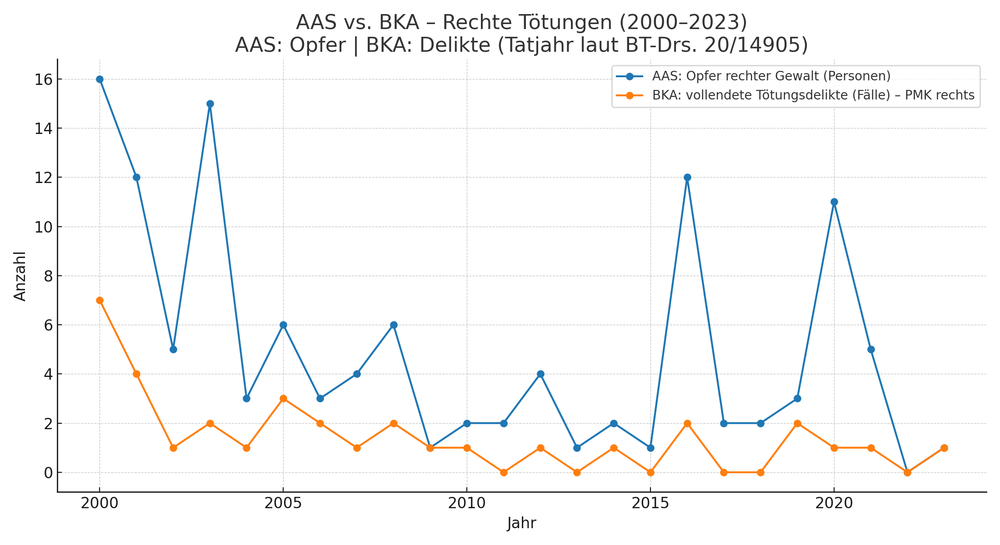
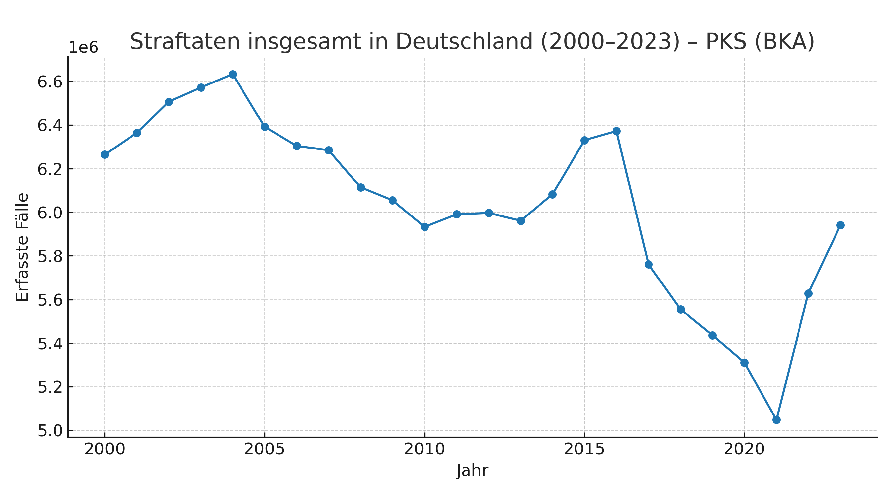
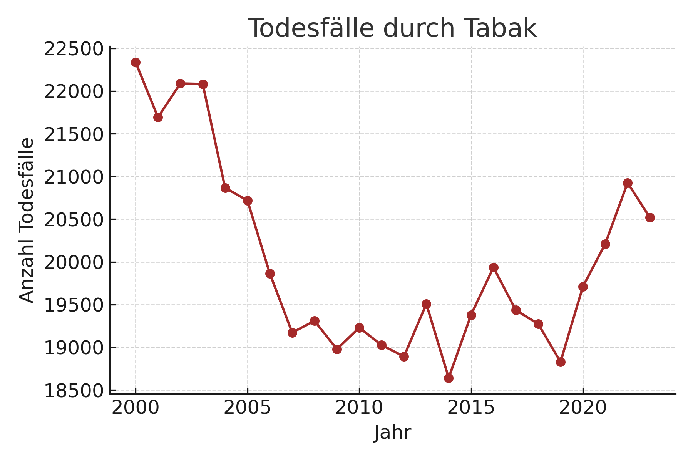

# Todesursachen, politische Gewalt & Kriminalität (Deutschland, 2000–2023)

**Diese Variante funktioniert, wenn alle PNGs/CSVs im Repository-Root liegen.**  
(Lege die Dateien aus `TODESSTATISTIKEN/` direkt in den Repo-Stamm, dann zeigt GitHub die Bilder inline.)

## Übersicht der Diagramme

### Todesopfer rechter Gewalt (AAS, 2000–2023)

**CSV:** [AAS_Deaths_2000_2023.csv](AAS_Deaths_2000_2023.csv)

### Vergleich: AAS vs. BKA (Todesopfer rechter Gewalt, 2000–2023)

**CSV:** [AAS_vs_BKA_Deaths_2000_2023.csv](AAS_vs_BKA_Deaths_2000_2023.csv)

### Todesfälle durch Alkohol (F10, K70, X45, Y15)

**CSV:** [alkohol.csv](alkohol.csv)

### Amoktaten an Schulen – Todesopfer (2000–2023)

**CSV:** [amok_schulen_tote_2000_2023.csv](amok_schulen_tote_2000_2023.csv)

### BKA PMK Rechts – Vollendete Tötungsdelikte (2000–2023)

**CSV:** [bka_pmk_rechts_toetungsdelikte_vollendet_2000_2023.csv](bka_pmk_rechts_toetungsdelikte_vollendet_2000_2023.csv)

### Todesopfer islamistischer Anschläge (2000–2023)

**CSV:** [islamistische_anschlaege_tote_2000_2023.csv](islamistische_anschlaege_tote_2000_2023.csv)

### Straftaten insgesamt in Deutschland (2000–2023) – PKS

**CSV:** [pks_straftaten_2000_2023.csv](pks_straftaten_2000_2023.csv)

### PMK Gewalttaten (links/rechts, 2012–2023)

**CSV:** [pmk_gewalttaten_links_rechts_2012_2023.csv](pmk_gewalttaten_links_rechts_2012_2023.csv)

### PMK Links – Morde (2000–2023)

**CSV:** [pmk_links_morde_2000_2023.csv](pmk_links_morde_2000_2023.csv)

### Todesfälle durch psychische Krankheiten (F00–F99)

### Todesfälle durch Tabak

**CSV:** [tabak.csv](tabak.csv)

### Toedliche Arbeitsunfaelle 2000 2023

**CSV:** [toedliche_arbeitsunfaelle_2000_2023.csv](toedliche_arbeitsunfaelle_2000_2023.csv)

### Variant A T92 Familieplus 2000 2023

**CSV:** [variant_A_T92_familieplus_2000_2023.csv](variant_A_T92_familieplus_2000_2023.csv)

### Variant B T91 Unter18 2000 2023

**CSV:** [variant_B_T91_unter18_2000_2023.csv](variant_B_T91_unter18_2000_2023.csv)

### Verkehrstote 2000 2023

**CSV:** [verkehrstote_2000_2023.csv](verkehrstote_2000_2023.csv)

## Quellen

Vollständige Quellenliste: [`Sources.md`](Sources.md)

---

## Todeszahlen in Deutschland 2000–2023 (eigene Auswertung)

Die folgenden Zahlen basieren auf offiziellen Statistiken (Statistisches Bundesamt, BKA, AAS) und enthalten ausschließlich dokumentierte Todesfälle im Zeitraum **2000 bis 2023**.
**Hinweis:** Bei *psychischen und Verhaltensstörungen* handelt es sich um die **Summe aller Todesfälle mit entsprechender Diagnose** – nicht ausschließlich um Gewalttaten.

| Rang | Thema                                                        | Summe 2000–2023 |
| ---- | ------------------------------------------------------------ | --------------- |
| 1    | Todesfälle mit Diagnose „psychische und Verhaltensstörungen“ | **935.608**     |
| 2    | Todesfälle durch Alkohol                                     | **480.615**     |
| 3    | Verkehrstote                                                 | **102.854**     |
| 4    | Tödliche Arbeitsunfälle                                      | **12.411**      |
| 5    | Tötungsdelikte in der Familie                                | **9.553**       |
| 6    | Tötungsdelikte an Minderjährigen                             | **2.245**       |
| 7    | Rechte Morde                                                 | **119**         |
| 8    | Tote durch Amokläufe an Schulen                              | **35**          |
| 9    | Islamistische Anschläge (Tote)                               | **16**          |
| 10   | Linke Morde                                                  | **0**           |

