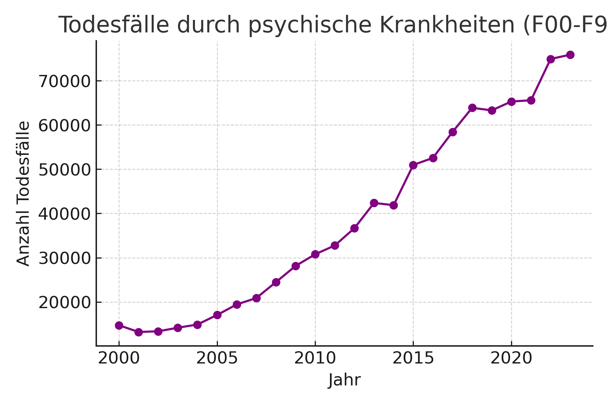
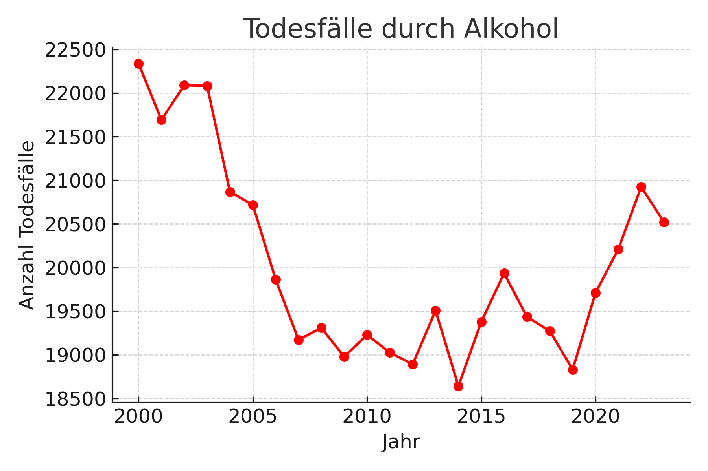

# Todesursachen, politische Gewalt & Kriminalität (Deutschland, 2000–2023)

## Übersicht (2000–2023) – nach Summe sortiert

_Hinweis: Bei „psychische und Verhaltensstörungen“ handelt es sich um die Summe der Todesfälle **mit entsprechender Diagnose**, nicht ausschließlich um Gewalttaten._

### 1. Todesfälle mit Diagnose „psychische und Verhaltensstörungen“ — **935.608**
- CSV: [f00-f99.csv](f00-f99.csv)
- Plot: 

### 2. Todesfälle durch Alkohol — **480.615**
- CSV: [alkohol.csv](alkohol.csv)
- Plot: 

### 3. Verkehrstote — **102.854**
- CSV: [verkehrstote_2000_2023.csv](verkehrstote_2000_2023.csv)

### 4. Tödliche Arbeitsunfälle — **12.411**
- CSV: [toedliche_arbeitsunfaelle_2000_2023.csv](toedliche_arbeitsunfaelle_2000_2023.csv)

### 5. Tötungsdelikte in der Familie — **9.553**
- CSV: [variant_A_T92_familieplus_2000_2023.csv](variant_A_T92_familieplus_2000_2023.csv)

### 6. Tötungsdelikte an Minderjährigen — **2.245**
- CSV: [variant_B_T91_unter18_2000_2023.csv](variant_B_T91_unter18_2000_2023.csv)

### 7. Rechte Morde — **119**
- CSV: [AAS_Deaths_2000_2023.csv](AAS_Deaths_2000_2023.csv)

### 8. Tote durch Amokläufe an Schulen — **35**
- CSV: [amok_schulen_tote_2000_2023.csv](amok_schulen_tote_2000_2023.csv)

### 9. Islamistische Anschläge (Tote) — **16**
- CSV: [islamistische_anschlaege_tote_2000_2023.csv](islamistische_anschlaege_tote_2000_2023.csv)

### 10. Linke Morde — **0**
- CSV: [pmk_links_morde_2000_2023.csv](pmk_links_morde_2000_2023.csv)

## Quellen

Vollständige Quellenliste: [`Sources.md`](Sources.md)

---

## Todeszahlen in Deutschland 2000–2023 (eigene Auswertung)

Die folgenden Zahlen basieren auf offiziellen Statistiken (Statistisches Bundesamt, BKA, AAS) und enthalten ausschließlich dokumentierte Todesfälle im Zeitraum **2000 bis 2023**.
**Hinweis:** Bei *psychischen und Verhaltensstörungen* handelt es sich um die **Summe aller Todesfälle mit entsprechender Diagnose** – nicht ausschließlich um Gewalttaten.

| Rang | Thema                                                        | Summe 2000–2023 |
| ---- | ------------------------------------------------------------ | --------------- |
| 1    | Todesfälle mit Diagnose „psychische und Verhaltensstörungen“ | **935.608**     |
| 2    | Todesfälle durch Alkohol                                     | **480.615**     |
| 3    | Verkehrstote                                                 | **102.854**     |
| 4    | Tödliche Arbeitsunfälle                                      | **12.411**      |
| 5    | Tötungsdelikte in der Familie                                | **9.553**       |
| 6    | Tötungsdelikte an Minderjährigen                             | **2.245**       |
| 7    | Rechte Morde                                                 | **119**         |
| 8    | Tote durch Amokläufe an Schulen                              | **35**          |
| 9    | Islamistische Anschläge (Tote)                               | **16**          |
| 10   | Linke Morde                                                  | **0**           |

